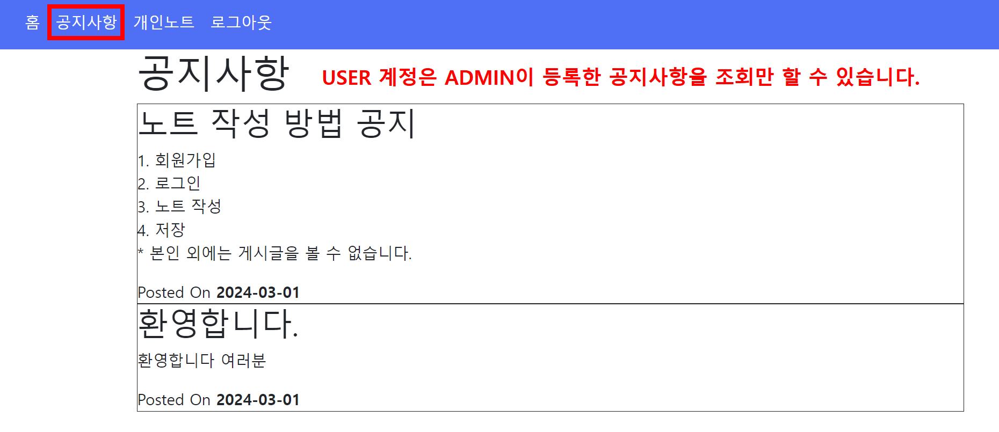

# Spring Security 기반 인증/인가 기능 개발 과제입니다. 

<br/>

### ~~~본 과제는 AWS EC2 서버를 통해 구동 중입니다. ~~~ ▶ 현재는 다른 사이드 프로젝트가 구동 중입니다. LINK: http://3.24.136.158:8080/swagger-ui/index.html


<br/>

### 접속 URL : http://3.24.136.158:8080/


<br/>

---

<br/>

### 프로젝트는 Docker를 활용하여 이미지로 빌드하였습니다.
dockerhub를 통해 이미지를 다운받으실 수 있습니다.

```
docker pull dydydade/security-pjt:1.0.2
```

<br/>

### 단, mariadb,redis 이미지에 의존하고 있어 docker-compose 파일을 통해 구동하셔야 합니다.

```
services:
    aroundhub_db:
        image: mariadb:10.6 # mariadb 10.6 버전 이미지 사용
        container_name: db_master
        restart: always
        environment:
            MARIADB_ROOT_PASSWORD: ... # 실제 프로젝트의 설정에 맞게 변경
            MARIADB_DATABASE: ... # 실제 프로젝트의 설정에 맞게 변경
            MARIADB_USER: ... # 실제 프로젝트의 설정에 맞게 변경
            MARIADB_PASSWORD: ... # 실제 프로젝트의 설정에 맞게 변경
        volumes:
            - ./master_db/data:/var/lib/mysql # 각종 log와 index 등이 volume에 저장되는 디렉토리
            - ./master_db/config/:/etc/mysql/conf.d # 설정을 reference 해 줍니다.
        ports:
            - "3308:3306"
    
    aroundhub_redis:
        image: redis:7.0.0
        restart: always
        ports:
            - "6380:6379"
            
    security_pjt:
        image: dydydade/security-pjt:1.0.2
        restart: always
        depends_on:
            - aroundhub_db      # mariadb 이미지와
            - aroundhub_redis   # redis 이미지에 의존하고 있습니다.
        ports:
            - "8080:8080"
```
<br/>

---

<br/>

### View Engine 으로는 타임리프(Thymeleaf)를 사용하였습니다.
그러나 View 코드는 과제에서 핵심적인 내용이 아니기 때문에, 문서에서는 설명을 생략하겠습니다.

### HTML 소스는 fastcampus 강의 예제 코드를 활용하였습니다.

<br/>

---

<br/>

# 1. 기능 소개

<br/>

### 권한 구분
사용자 계정 권한은 USER 와 ADMIN 으로 구분되며, 아래 회원 가입을 통해 가입 시 USER 권한이 부여됩니다.

<br/>

---

<br/>

### 1) 회원가입


▼


(가입 시 자동으로 USER 권한 부여)

<br/>

---

<br/>

### 2) 로그인(USER)


▼

USER 권한을 가진 계정으로 로그인하면, [공지사항], [개인노트], [로그아웃] 버튼이 나타납니다.


<br/>

---

<br/>

### 3) 개인노트(USER)


(새 글 쓰기 버튼을 클릭하면 모달 창이 나타납니다.)


저장 버튼 클릭 시 아래와 같이 노트가 저장되고, 

저장된 노트는 최근 수정일자를 기준으로 3개씩 조회됩니다.(Pagination 활용)


<br/>

---

<br/>

### 4) 공지사항 조회(USER)



<br/>

---

<br/>

### 5) 로그아웃
로그아웃 버튼 클릭 시, 초기 홈 화면으로 이동합니다.


▼


<br/>

---

<br/>

### 6) 로그인(ADMIN)


▼

ADMIN 권한을 가진 계정으로 로그인하면, [관리자 페이지], [공지사항], [로그아웃] 버튼이 나타납니다.


<br/>

---

<br/>

### 7) 관리자 페이지(ADMIN)

관리자(ADMIN)는 사용자가 등록한 모든 노트를 조회할 수 있습니다.


<br/>

---

<br/>

### 8) 공지사항 등록/삭제(ADMIN)

관리자(ADMIN)는 새로운 공지사항을 추가하거나 삭제할 수 있습니다.


[새 글 쓰기] 버튼을 클릭하면, 모달 창이 나타납니다.


[저장] 버튼 클릭 시, 공지사항이 저장됩니다.


저장된 공지사항은 사용자 계정으로도 조회가 가능합니다.


<br/>

---

<br/>


# 2. 구현 코드

<br/>

### 0) Spring Security Config
<details>
<summary>전체 코드 보기</summary>

<!-- summary 아래 한칸 공백 두어야함 -->
```java
@Configuration
@EnableWebSecurity
@RequiredArgsConstructor
public class SpringSecurityConfig {

    private final UserService userService;

    @Bean
    public SecurityFilterChain filterChain(HttpSecurity http) throws Exception {
        http
                // Basic 인증 비활성화
                .httpBasic(httpBasic -> httpBasic.disable())
                // CSRF 설정
                .csrf(csrf -> {})
                // Remember-me 설정
                .rememberMe(rememberMe -> rememberMe.tokenValiditySeconds(86400))
                // 권한 설정
                .authorizeHttpRequests(auth -> auth
                        .requestMatchers("/", "/home", "/signup").permitAll()
                        .requestMatchers("/note").hasRole("USER")
                        .requestMatchers("/admin").hasRole("ADMIN")
                        .requestMatchers(HttpMethod.POST, "/notice").hasRole("ADMIN")
                        .requestMatchers(HttpMethod.DELETE, "/notice").hasRole("ADMIN")
                        .anyRequest().authenticated()
                )
                // 로그인 설정
                .formLogin(form -> form
                        .loginPage("/login")
                        .defaultSuccessUrl("/")
                        .permitAll()
                )
                .logout(logout -> logout
                        .logoutRequestMatcher(new AntPathRequestMatcher("/logout"))
                        .logoutSuccessUrl("/")
                        .permitAll()
                );

        return http.build();
    }

    @Bean
    public WebSecurityCustomizer webSecurityCustomizer() {
        // 정적 리소스 spring security 대상에서 제외
        return (web) -> web.ignoring().requestMatchers(PathRequest.toStaticResources().atCommonLocations());
    }

    /**
     * DaoAuthenticationProvider 가 사용할 UserDetailsService 구현
     * @return UserDetailsService
     */
    @Bean
    public UserDetailsService userDetailsService() {
        return username -> {
            User user = userService.findByUsername(username);
            if (user == null) {
                throw new UsernameNotFoundException(username);
            }
            return user;
        };
    }
}
```

</details>

<br/>

---


▼ 한 부분씩 나눠서 보기

---

- Basic 인증 기능 : 비활성화
- csrf(Cross Site Request Forgery) 기능 : 활성화
- rememeberMe 기능 : 활성화

```java
@Configuration
@EnableWebSecurity
@RequiredArgsConstructor
public class SpringSecurityConfig {

    private final UserService userService;

    @Bean
    public SecurityFilterChain filterChain(HttpSecurity http) throws Exception {
        http
                // Basic 인증 비활성화
                .httpBasic(httpBasic -> httpBasic.disable())
                // CSRF 설정
                .csrf(csrf -> {})
                // Remember-me 설정
                .rememberMe(rememberMe -> rememberMe.tokenValiditySeconds(86400));
                // .....e
    }
}
```

<br/>

---

<br/>

- 경로 별 권한 설정
- "/", "/home", "/signup" 경로로의 요청은 모두 허용
- "/note" 경로로의 요청은 USER 권한 보유 계정에만 허용
- "/admin" 경로로의 요청은 ADMIN 권한 보유 계정에만 허용
- "/notice" 경로로의 POST, DELETE 요청은 ADMIN 권한 보유 계정에만 허용
- form login 설정("/login" → 성공 시 "/"로 리다이렉트)
- logout 설정("/logout" → 성공 시 "/"로 리다이렉트)

```java
@Configuration
@EnableWebSecurity
@RequiredArgsConstructor
public class SpringSecurityConfig {

    private final UserService userService;

    @Bean
    public SecurityFilterChain filterChain(HttpSecurity http) throws Exception {
        http
                // .....
                // 권한 설정
                .authorizeHttpRequests(auth -> auth
                        .requestMatchers("/", "/home", "/signup").permitAll()
                        .requestMatchers("/note").hasRole("USER")
                        .requestMatchers("/admin").hasRole("ADMIN")
                        .requestMatchers(HttpMethod.POST, "/notice").hasRole("ADMIN")
                        .requestMatchers(HttpMethod.DELETE, "/notice").hasRole("ADMIN")
                        .anyRequest().authenticated()
                )
                // 로그인 설정
                .formLogin(form -> form
                        .loginPage("/login")
                        .defaultSuccessUrl("/")
                        .permitAll()
                )
                .logout(logout -> logout
                        .logoutRequestMatcher(new AntPathRequestMatcher("/logout"))
                        .logoutSuccessUrl("/")
                        .permitAll()
                );

        return http.build();
    }
    // .....
}
```

<br/>

---

<br/>

- 정적 리소스(.css, .img 등)는 spring security 대상에서 제외
- permitAll() 설정과 비슷하지만, 아예 Spring Security Filter가 실행되지 않아 오버헤드가 없음
- DaoAuthenticationProvider가 사용할 UserDetailsService 구현
- Spring Security는 내부적으로 개발자가 등록한 UserDetailsService를 통해 UserDetails 객체를 조회함

```java
@Configuration
@EnableWebSecurity
@RequiredArgsConstructor
public class SpringSecurityConfig {

    private final UserService userService;
    
    // .....

    @Bean
    public WebSecurityCustomizer webSecurityCustomizer() {
        // 정적 리소스 spring security 대상에서 제외
        return (web) -> web.ignoring().requestMatchers(PathRequest.toStaticResources().atCommonLocations());
    }

    /**
     * DaoAuthenticationProvider 가 사용할 UserDetailsService 구현
     * @return UserDetailsService
     */
    @Bean
    public UserDetailsService userDetailsService() {
        return username -> {
            User user = userService.findByUsername(username);
            if (user == null) {
                throw new UsernameNotFoundException(username);
            }
            return user;
        };
    }
}
```

<br/>

---

<br/>

### 1) 회원가입
### SignUpController 코드
<details>
<summary>코드 보기</summary>

<!-- summary 아래 한칸 공백 두어야함 -->


</details>

### UserService 코드
<details>
<summary>코드 보기</summary>

<!-- summary 아래 한칸 공백 두어야함 -->


#### PasswordEncoder 빈 등록 코드


</details>

<br/>

---

<br/>

### 2) 로그인(USER)
### MvcConfig 코드
<details>
<summary>코드 보기</summary>

<!-- summary 아래 한칸 공백 두어야함 -->

- 단순히 요청을 특정 view와 매핑하는 역할만 하기 위해 Controller 대신 MvcConfig 활용
- "/login" 경로로의 요청이 View Resolver 통해 "login.html"로 매핑됨 

```java
@Configuration
public class MvcConfig implements WebMvcConfigurer {

    public void addViewControllers(ViewControllerRegistry registry) {
        registry.addViewController("/home").setViewName("index");
        registry.addViewController("/").setViewName("index");
        registry.addViewController("/login").setViewName("login");
    }
}

```

</details>

### SpringSecurityConfig 코드
<details>
<summary>코드 보기</summary>

<!-- summary 아래 한칸 공백 두어야함 -->
- 이후 위에서 살펴본 SpringSecurityConfig 설정을 통해 로그인 성공 시 "/" 경로로 리다이렉트됨
```
    // 로그인 설정
    .formLogin(form -> form
            .loginPage("/login")
            .defaultSuccessUrl("/")
            .permitAll()
    )
```
</details>

<br/>

---

<br/>

### 3) 개인노트(USER)
### NoteController 코드
<details>
<summary>코드 보기</summary>

<!-- summary 아래 한칸 공백 두어야함 -->
- getNotePage() : Note 페이지 조회
- saveNote() : Note 저장
```java
@Controller
@RequestMapping("/note")
@RequiredArgsConstructor
public class NoteController {

    private final NoteService noteService;

    /**
     * 노트(게시글) 조회
     *
     * @return 노트 view (note/index.html)
     */
    @GetMapping
    public String getNotePage(Authentication authentication) {
        return "note/index";
    }

    /**
     * 노트 저장
     */
    @PostMapping
    public String saveNote(Authentication authentication, @ModelAttribute NoteRegisterDto noteRegisterDto) {
        User user = (User) authentication.getPrincipal();
        noteService.saveNote(user, noteRegisterDto.getSubject(), noteRegisterDto.getContent());
        return "redirect:note";
    }
}
```

- 위에서의 Sprnig Security 설정에 따라 Note 페이지로의 접근은 USER 권한을 가진 계정만 가능

```
http
    // .....
    // 권한 설정
    .authorizeHttpRequests(auth -> auth
            .requestMatchers("/note").hasRole("USER")
    )
    // .....
```
</details>

### NoteRestController 코드
<details>
<summary>코드 보기</summary>

<!-- summary 아래 한칸 공백 두어야함 -->
- NoteRestController 를 따로 만든 이유 : Pagination 활용한 [더보기] 버튼을 만들기 위해, js로 AJAX 요청을 수행하도록 작성

- getNotePageData() : Note 페이지의 Note 목록 조회
- deleteNote() : Note 삭제
```java
@RestController
@RequiredArgsConstructor
public class NoteRestController {

    private final NoteService noteService;

    @GetMapping("/notes")
    public ResponseEntity<Map<String, Object>> getNotePageData(Authentication authentication,
                                                               @RequestParam(defaultValue = "0") int page,
                                                               @RequestParam(defaultValue = "3") int size) {
        User user = (User) authentication.getPrincipal();
        // page 번호, page 사이즈를 통해 Slice 조회
        // findByUser 메서드를 통해 데이터 조회하므로 대상 사용자의 Note 목록만 조회
        Slice<NoteResponseDto> noteSlice = noteService.findByUser(user, page, size);
        Map<String, Object> response = new HashMap<>();
        response.put("notes", noteSlice.getContent());
        response.put("hasNext", noteSlice.hasNext());

        return ResponseEntity.ok(response);
    }

    @DeleteMapping("/note/{id}")
    public ResponseEntity<?> deleteNote(
            Authentication authentication,
            @PathVariable Long id) {
        User user = (User) authentication.getPrincipal();
        noteService.deleteNote(user, id);
        return ResponseEntity.ok().build();
    }
}
```
</details>

### NoteService 코드
<details>
<summary>코드 보기</summary>

<!-- summary 아래 한칸 공백 두어야함 -->
- findByUser() : 권한에 따라 조회 가능한 Note를 DTO 객체로 변환하여 반환
- saveNote() : Note 저장(인가된 user 일 경우에만)
- deleteNote() : Note 삭제(인가된 user 일 경우에만)
```java
@Service
@RequiredArgsConstructor
public class NoteService {

    private final NoteRepository noteRepository;

    /**
     * 노트 조회
     * 유저는 본인의 노트만 조회할 수 있다.
     * 어드민은 모든 노트를 조회할 수 있다.
     *
     * @param user 노트를 찾을 유저
     * @return 유저가 조회할 수 있는 모든 노트 List
     */
    @Transactional(readOnly = true)
    public Slice<NoteResponseDto> findByUser(User user, int page, int size) {
        if (user == null) {
            throw new UserNotFoundException(); // user 가 확인되지 않을 경우, Custon Exception을 던짐
        }
        if (user.isAdmin())
            return noteRepository.findAll(PageRequest.of(page, size, Sort.by(Sort.Direction.DESC, "updatedAt"))) // updatedAt 기준으로 정렬
                    .map(note -> new NoteResponseDto(note));
        return noteRepository.findByUser(user, PageRequest.of(page, size, Sort.by(Sort.Direction.DESC, "updatedAt")))
                .map(note -> new NoteResponseDto(note));
    }

    /**
     * 노트 저장
     * @param user    노트 저장하는 유저
     * @param subject   제목
     * @param content 내용
     * @return 저장된 노트
     */
    @Transactional
    public Note saveNote(User user, String subject, String content) {
        if (user == null) {
            throw new UserNotFoundException();
        }
        return noteRepository.save(new Note(subject, content, user));
    }

    /**
     * 노트 삭제
     *
     * @param user   삭제하려는 노트의 유저
     * @param noteId 노트 ID
     */
    @Transactional
    public void deleteNote(User user, Long noteId) {
        if (user == null) {
            throw new UserNotFoundException();
        }
        Note note = noteRepository.findByIdAndUser(noteId, user);
        if (note != null) {
            noteRepository.delete(note);
        }
    }
}

```
</details>

<br/>

---

<br/>

### 4) 공지사항 조회(USER)

### NoticeController 코드
<details>
<summary>코드 보기</summary>

<!-- summary 아래 한칸 공백 두어야함 -->
- getNoticePage() : Notice(공지사항) 조회 
```java
@Controller
@RequestMapping("/notice")
@RequiredArgsConstructor
public class NoticeController {

    private final NoticeService noticeService;

    @GetMapping
    public String getNoticePage(Model model) {
        List<Notice> notices = noticeService.findAll();
        model.addAttribute("notices", notices);
        return "notice/index";
    }
    
    // .....
}
```
</details>

### NoticeService 코드
<details>
<summary>코드 보기</summary>

<!-- summary 아래 한칸 공백 두어야함 -->
- findAll() : 모든 Notice(공지사항) 조회, notice id 기준 내림차순 정렬
```java
@Service
@RequiredArgsConstructor
public class NoticeService {

    private final NoticeRepository noticeRepository;

    @Transactional(readOnly = true)
    public List<Notice> findAll() {
        return noticeRepository.findAll(Sort.by(Sort.Direction.DESC, "id"));
    }
    
    // .....
}
```
</details>

<br/>

---

<br/>

### 5) 로그아웃

### SpringSecurityConfig 코드

<details>
<summary>코드 보기</summary>

<!-- summary 아래 한칸 공백 두어야함 -->

- 아래의 Spring Security 코드가 "/logout" 경로로의 요청을 처리한 후, "/" 경로로 매핑해 줌
```java
@Configuration
@EnableWebSecurity
@RequiredArgsConstructor
public class SpringSecurityConfig {

    private final UserService userService;

    @Bean
    public SecurityFilterChain filterChain(HttpSecurity http) throws Exception {
        http
                // .....
                .logout(logout -> logout
                        .logoutRequestMatcher(new AntPathRequestMatcher("/logout"))
                        .logoutSuccessUrl("/")
                        .permitAll()
                );

        return http.build();
    }
    // .....
}
```
</details>

<br/>

---

<br/>

### 6) 로그인(ADMIN)
- 로그인(USER) 코드와 동일(생략)

<br/>

---

<br/>

### 7) 관리자 페이지(ADMIN)

### AdminController 코드

<details>
<summary>코드 보기</summary>

<!-- summary 아래 한칸 공백 두어야함 -->
- getNoteForAdmin() : ADMIN 계정은 모든 사용자의 Note 조회 가능
```java
@Controller
@RequestMapping("/admin")
@RequiredArgsConstructor
public class AdminController {

    private final NoteService noteService;

    /**
     * admin 사용자로 note 조회 시 모든 note 가 조회됨.
     */
    @GetMapping
    public String getNoteForAdmin(Authentication authentication, Model model) {
        User user = (User) authentication.getPrincipal();
        List<Note> notes = noteService.findByUser(user);
        model.addAttribute("notes", notes);
        return "admin/index";
    }
}
```
</details>

<br/>

---

<br/>

### 8) 공지사항 등록/삭제(ADMIN)

### NoticeController 코드

<details>
<summary>코드 보기</summary>

<!-- summary 아래 한칸 공백 두어야함 -->
- saveNotice() : ADMIN 계정은 신규 Notice(공지사항) 등록 가능
- deleteNotice() : ADMIN 계정은 기존 Notice(공지사항) 삭제 가능
```java
@Controller
@RequestMapping("/notice")
@RequiredArgsConstructor
public class NoticeController {

    private final NoticeService noticeService;

    // .....

    @PostMapping
    public String saveNotice(Authentication authentication, String subject, String content) {
        User user = (User) authentication.getPrincipal();
        noticeService.saveNotice(user, subject, content);
        return "redirect:/notice";
    }

    @DeleteMapping
    public String deleteNotice(Authentication authentication, @RequestParam Long id) {
        User user = (User) authentication.getPrincipal();
        noticeService.deleteById(user, id);
        return "redirect:/notice";
    }
}
```
</details>

### NoticeService 코드

<details>
<summary>코드 보기</summary>

<!-- summary 아래 한칸 공백 두어야함 -->
- saveNotice() : ADMIN 계정은 신규 Notice(공지사항) 등록 가능
- deleteNotice() : ADMIN 계정은 기존 Notice(공지사항) 삭제 가능
- ADMIN이 아닌 사용자가 공지사항 등록, 삭제를 시도하면 UnauthorizedAccessAttemptException 예외를 던짐
```java
@Service
@RequiredArgsConstructor
public class NoticeService {

    private final NoticeRepository noticeRepository;

    // .....

    @Transactional
    public Notice saveNotice(User user, String subject, String content) {
        if (!user.isAdmin()) {
            throw new UnauthorizedAccessAttemptException("ADMIN 권한을 보유한 사용자만 공지사항 등록이 가능합니다.");
        }
        return noticeRepository.save(
                Notice.builder()
                        .subject(subject)
                        .content(content)
                        .build());
    }

    @Transactional
    public void deleteById(User user, Long id) {
        if (!user.isAdmin()) {
            throw new UnauthorizedAccessAttemptException("ADMIN 권한을 보유한 사용자만 공지사항 삭제가 가능합니다.");
        }
        noticeRepository.deleteById(id);
    }
}
```
</details>

<br/>

---

<br/>


# 2. 테스트 코드(일부)

### 1) SignUpController Test 코드
- Controller 테스트를 단위테스트로 진행할 경우, Spring Security 관련 Bean 들을 로드하지 않아 오류가 발생
- 추후 방법을 찾아보기로 하고, 여기서는 우선 @SpringBootTest 기반 통합테스트로 진행

```java
@SpringBootTest
@AutoConfigureMockMvc
@ActiveProfiles(profiles = "test")
class SignUpControllerTest {

    @Autowired
    private MockMvc mockMvc;

    @MockBean
    private UserService userService;

    @Test
    @DisplayName("권한이 없는 사용자가 회원가입 페이지에 접근해도 오류가 발생하지 않는다.")
    public void getSignupPageTest() throws Exception {
        // given
        // when
        // then
        mockMvc.perform(get("/signup"))
                .andExpect(status().isOk())
                .andExpect(view().name("signup"));
    }

    @Test
    @DisplayName("유저가 ID와 PW를 입력하고 회원가입하면 로그인 페이지로 리다이렉트된다.")
    public void postSignupTest() throws Exception {
        // given
        // when
        // then
        mockMvc.perform(post("/signup").with(csrf())
                .contentType(MediaType.APPLICATION_FORM_URLENCODED)
                .param("username", "username")
                .param("password", "password")
        )
                .andExpect(redirectedUrl("login"))
                .andExpect(status().is3xxRedirection());
    }
}
```

<br/>

---

<br/>

### 2) UserService Test 코드

- Service Test 코드의 경우, Spring Security 에 대한 의존성이 없으므로 단위테스트로 작성

```java
@ExtendWith(MockitoExtension.class)
class UserServiceTest {

    @InjectMocks
    private UserService userService;

    @Mock
    UserRepository userRepository;

    @Mock
    PasswordEncoder passwordEncoder;

    @Test
    @DisplayName("기존에 동일한 ID를 가진 사용자가 있을 경우 예외가 반환된다.")
    void signUpWithExistingUsernameShouldThorwException() {
        // given
        String username = "user";
        String password = "user";
        String authority = "ROLE_USER";
        User existingUser = new User(username, password, authority);

        when(userRepository.findByUsername(username)).thenReturn(existingUser);

        // when
        // then
        assertThatThrownBy(() -> {
            userService.signUp(username, password, authority);
        }).isInstanceOf(AlreadyRegisteredUserException.class);
    }

    @Test
    @DisplayName("기존에 동일한 ID를 가진 사용자가 없을 경우 사용자가 저장된다.")
    void signUpWithNewUsernameShouldSaveUser() {
        // given
        String username = "user";
        String password = "user";
        String authority = "ROLE_USER";
        User newUser = new User(username, password, authority);

        when(userRepository.findByUsername(username)).thenReturn(null);
        when(userRepository.save(any())).thenReturn(newUser);

        when(passwordEncoder.encode(any())).thenReturn("encodedPasswordFake");

        assertThat(userService.signUp(username, password, authority))
                .isEqualTo(newUser);
    }

    @Test
    @DisplayName("username 을 통해 저장된 user 를 조회할 수 있다.")
    void findByUsernameShouldReturnSavedUser() {
        // given
        String username = "user";
        String password = "user";
        String authority = "ROLE_USER";
        User existingUser = new User(username, password, authority);

        when(userRepository.findByUsername(username)).thenReturn(existingUser);

        // when
        // then
        assertThat(userService.findByUsername(username)).isEqualTo(existingUser);
    }
}
```


